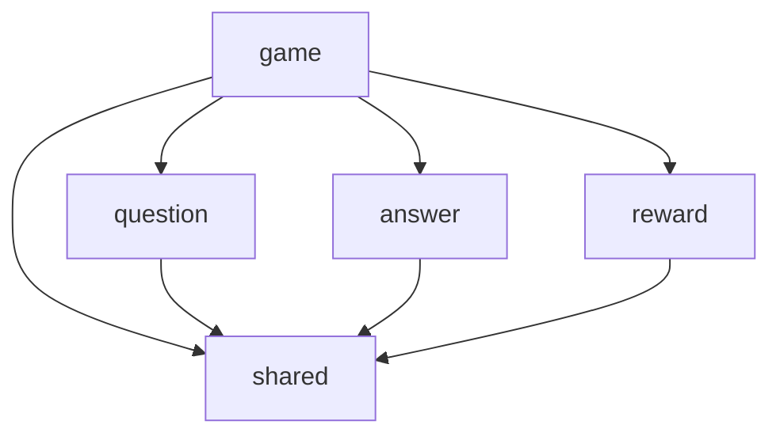

# :money_with_wings: Who wants to be a millionaire?


[](https://github.com/edvein-rin/who-wants-to-be-a-millionaire/blob/master/LICENSE)

A simple "Who wants to be a millionaire" web game implementation.

:sparkles: [CLICK TO PLAY](https://who-wants-to-be-a-millionaire-orcin.vercel.app/) :sparkles:

## Stack

- **Language:** [TypeScript](https://www.typescriptlang.org/)
- **Framework:** [Next.js](https://nextjs.org/)
- **Styling:** [CSS modules](https://github.com/css-modules/css-modules)
- **Linting:** [ESLint](https://eslint.org/)
- **Testing:** [vitest](https://vitest.dev/), [React Testing Library](https://testing-library.com/docs/react-testing-library/intro/), [StoryBook](https://storybook.js.org/), [Playwright](https://playwright.dev/)
- **CI/CD**: [GitHub Actions](https://github.com/features/actions), [Husky](https://typicode.github.io/husky/), [lint-staged](https://github.com/lint-staged/lint-staged), [commitlint](https://commitlint.js.org/)
- **Deployment**: [Vercel](https://vercel.com/)

## Requirements

[nvm](https://github.com/nvm-sh/nvm) any version.  
[pnpm](https://pnpm.io/installation) version `>= 10`.

## Installation

```
nvm install
nvm use
pnpm install
```

## Usage

### Development

```bash
pnpm dev
```

### Building

```bash
pnpm build
```

```bash
# Start build locally
pnpm start
```

### Testing

```bash
pnpm test
```

```bash
# Watch for file changes and rerun tests
pnpm test:watch
```

### Linting

```bash
pnpm lint
```

```bash
# Fix what can be fixed automatically
pnpm lint:fix
```

```bash
# Lint staged files only
pnpm lint:staged
```

## Architecture

Modular front-end a little bit inspired by `Nest.js` structure.

### Folder Structure

```
.
├── ...
├── public                  # Public assets
│   └── images
│           └── icons
├── src
│   ├── app                 # Next.js routing (pages)
│   └── modules             # Modules
│           ├── shared
│           ├── answer
│           └── ...
└── ...
```

### Modules

Modules provide a **public interface** for importing things from them via `index.ts`.  
What is not exported from a module can't be imported directly.  
By this, **cohesion** and **transparent dependencies** are achieved.

Components (ui/libs) inside a module can use each other.

#### Module Structure

```
.
├── ui         # React components
└── lib        # Functions, hooks etc
```

#### Existing Module Dependencies


